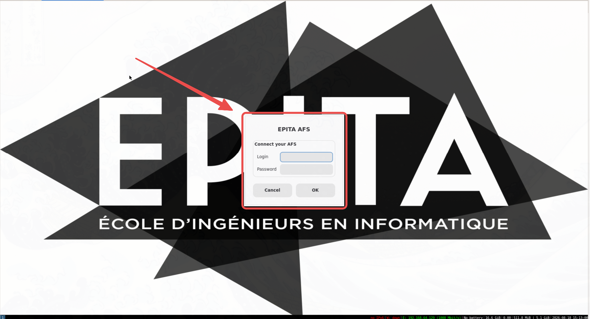

# epita-pie-vm



The real EPITA PIE desktop (i3, toolchains, AFS, your configs) at home,
built from [epita/nixpie](https://github.com/epita/nixpie).

## Virtual machine

[**Download (Proton Drive)**](https://drive.proton.me/urls/MY5JXCP7WM#WIaGUEoOySxV):
`epita-pie-virtualbox.ova` or `epita-pie-vmware.ova` (~13 GB each),
plus `SHA256SUMS`.

```sh
sha256sum -c SHA256SUMS
```

Import (VirtualBox: File > Import Appliance; VMware: File > Open), boot.
Log in on the AFS window for your real EPITA files, or skip it for a
local session (user `epita`, no password, `/home/epita` persists).
Defaults: 6 GB RAM, 4 CPUs, NAT. Any network, no VPN.

Snapshot right after importing: that is your factory reset.

`~/afs` stuck or not reconnecting: `afs off`, then `afs`.

## Docker container

The same desktop over VNC, no hypervisor. Needs docker and a VNC viewer
(macOS built in; elsewhere `virt-viewer`).

```sh
./pie pull      # prebuilt image: ~13 GB download, ~30 GB on disk
./pie run       # start + open the VNC viewer (login epita/epita, or `afs`)
./pie reset     # stop
```

`pull` needs `PIE_IMAGE` pointed at a registry ref. The image bundles
EPITA-proprietary software: EPITA's internal registry only, or hand it
over as a file (`docker save | zstd` / `docker load`).

## Rebuild

- OVAs: `vm/build-ova.sh`. Docker, ~80 GB free disk, seeds a nix store
  from a local PIE image then builds; ~30 min seed + 1-3 h build.
- Container image: `./pie setup`. Needs `nixos-pie:latest` locally;
  ~10 min.

## Test `afs`

`tests/afs-lab.sh` fakes the EPITA gate locally (KDC + GSSAPI sshd);
`tests/afs-test.sh` replays the reconnect-the-next-day case in ~5 s.
Root, Ubuntu/Debian with `/dev/fuse`.
